## Decoding the secrets of the JVM internals <!-- .element: style="margin-bottom: 300px" -->
<!-- .slide: data-background-image="pexels-lenin-estrada-2569997.jpg" -->

---

<div style="display: flex; gap: 50px">
  
  <div style="display: flex; flex-direction: column; justify-content: center; text-align: left;">
    <div>
      Lennart ten Wolde<br />
      Software Engineer, CHILIT
    </div>
    <div style="margin-top: 50px">
      KPN IoT<br/>
      Backend Java Development
    </div>
  </div>
</div>

---

## Agenda

<!-- .slide: class="fragmented-lists" -->
- JVM Explained
- Memory management
- Garbage collection
- JVM GC timeline
- Shenandoah

---

## JVM

<!-- .slide: class="fragmented-lists" -->
- What is Java?
- What is OpenJDK?
- What is the JVM?

--

### This is Java

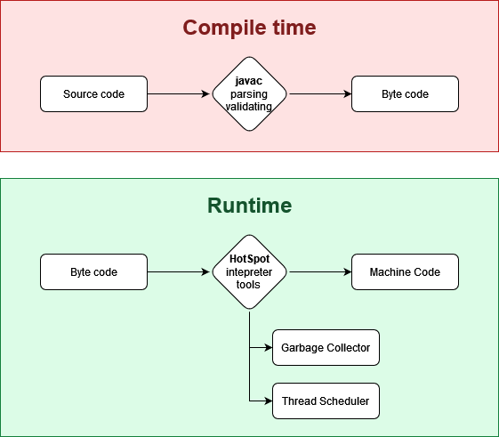

--

### This is the JVM

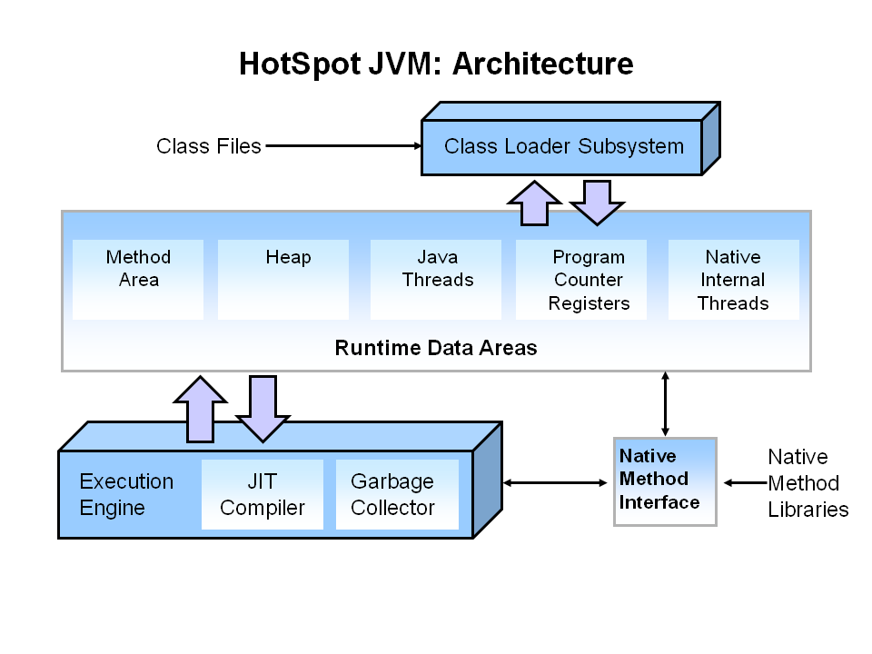 <!-- .element: height="500" -->

Note:
- The JVM consists of several components
- The JVM is an abstraction of a computer
- Same functionality available everywhere

--

### JVM Interpreter

<!-- .slide: class="fragmented-lists" -->
- The intepreter is an abstraction of the CPU
- It convert bytecode to the right CPU instructions
- Inteprets bytecode instructions one at a time

--

### JIT Compiler

<!-- .slide: class="fragmented-lists" -->
- Compile multiple bytecode instructions into machine code
- Perform platform optimizations

--

### JVM Memory

```java [|4-8]
public static void main(String[] args) {
    int argumentCount = args.length;
    String message = String.join(args, " ");
    if(argumentCount > 0) {
        System.out.println("Hello, " + message);
    } else {
        System.out.println("Hello, world!");
    }
}
```

--

### The memory hierarchy

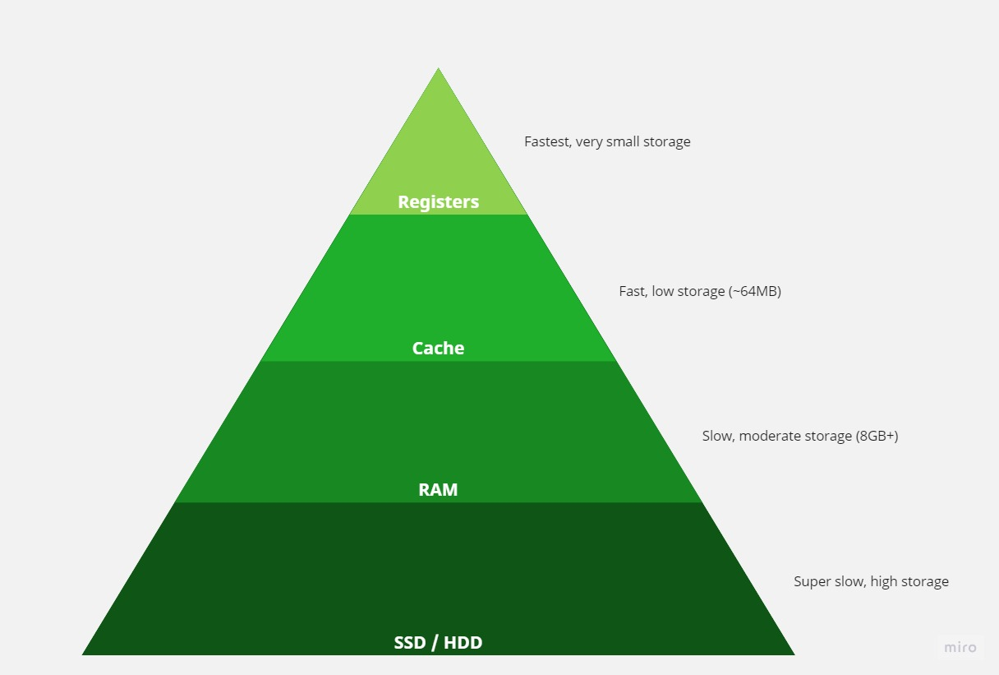 <!-- .element: height="500" -->

--

### JVM Memory


--

### Stack

 <!-- .element: height="500" -->

--

### Stack

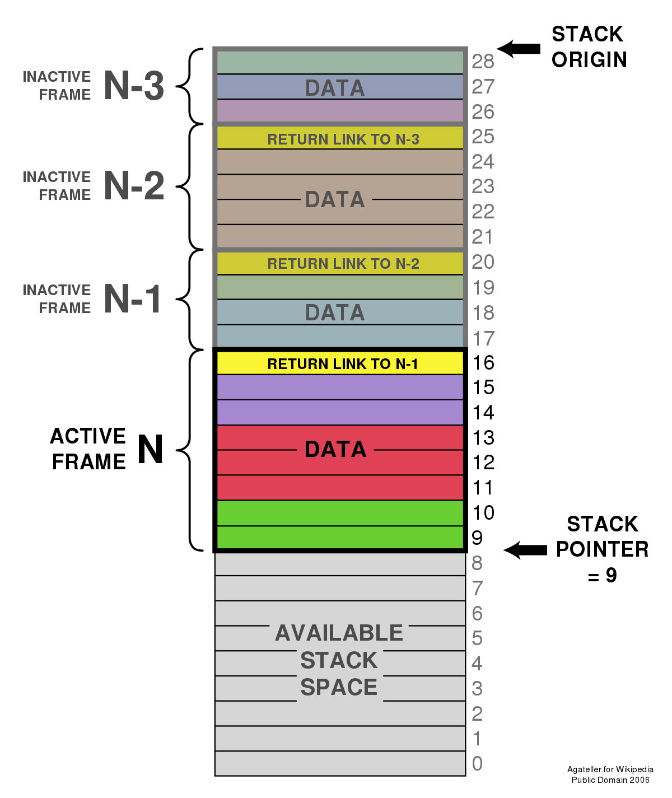 <!-- .element: height="500" style="background: white" -->

--

```c [|8|9|2|10]
void func1(int z) {
  int x = 5; // allocate an integer on the stack in func1
  std::cout << "func1: x = " << x << std::endl;
  std::cout << "main: z = " << z << std::endl;
}

int main() {
  int z = 15; // allocate an integer on the stack in main
  func1(z); // call func1
  return 0; // after func1 ended, x is not longe allocated
}
```

--

### Stack Advantages

- Automatic deallocation
- No fragmantation
- Good cache utilization

--

### Heap

 <!-- .element: height="500" -->

--

### Heap

```c [|2|3|5|7]
int main() {
  int* ptr = new int; // allocate an integer on the heap
  *ptr = 5; // assign a value to the integer

  std::cout << "Value of ptr: " << *ptr << std::endl;

  delete ptr; // free the memory allocated on the heap

  return 0;
}
```

--

### Java Stack

per-thread stack frames:
- primitives data
- object references (pointers)

--

### Java Heap

- All objects

--

### Heap deallocation

How do you deal with deallocating memory on the heap?

---

## Memory management

--

### Manual

```c [7]
int main() {
  int* ptr = new int; // allocate an integer on the heap
  *ptr = 5; // assign a value to the integer

  std::cout << "Value of ptr: " << *ptr << std::endl;

  delete ptr; // free the memory allocated on the heap

  return 0;
}

--

### Reference counting

```c++ [|6]
int main() {
  std::shared_ptr<int> ptr1(new int(5)); // allocate an integer on the heap using a shared_ptr
  std::shared_ptr<int> ptr2 = ptr1; // create another shared_ptr that points to the same memory

  // decrement the reference count of the shared_ptr
  ptr1.reset();

  // decrement the reference count of the shared_ptr again
  ptr2.reset();

  return 0;
}
```

--

### Reference counting

<!-- .slide: class="fragmented-lists" -->
- (Slightly) reduced throughput
- Automatic reference counting
  - Python
  - Objective-C & Swift
- Reference cycles

--

### Reference cycles

```java
class Human {
    String name;
    List<Pet> pets;
}

class Pet {
    Human owner;
}
```

--

## Garbage collection

A process seperate from the mutator (application code) thats finds and removes **unreachable** objects

--

### Lifecycle

1. Mutator allocates new objects
2. JVM runs out of memory
3. Mutator pauses while garbage collectors makes room

--

### Tracing garbage collection

<!-- .slide: class="fragmented-lists" -->
- Finds objects by tracing the references recursively from the root (stack)
  - Objects that **can't** be reached are considered dead / garbage
  - Objects that **can be** reached are marked live
- Sweep though memory and reclaim unmarked space
- Mark and Sweep

--

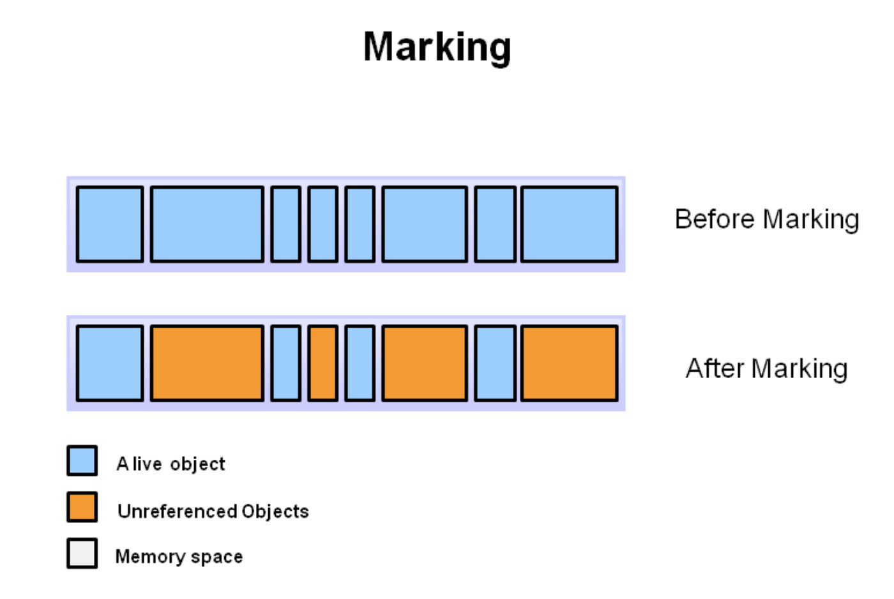

---

## Java Garbage Collection

Serial, Prallel, Garbage-First (G1), ZGC, Shenandoah

--

### Generational GC


--

### Remembered set

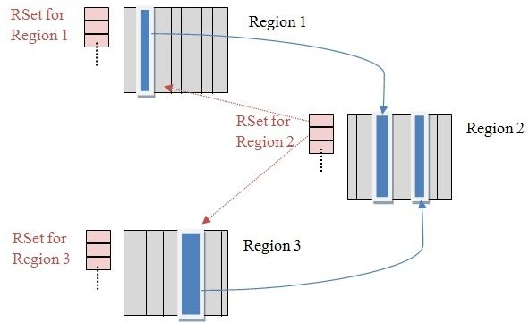

--

### Serial & Parallel GC

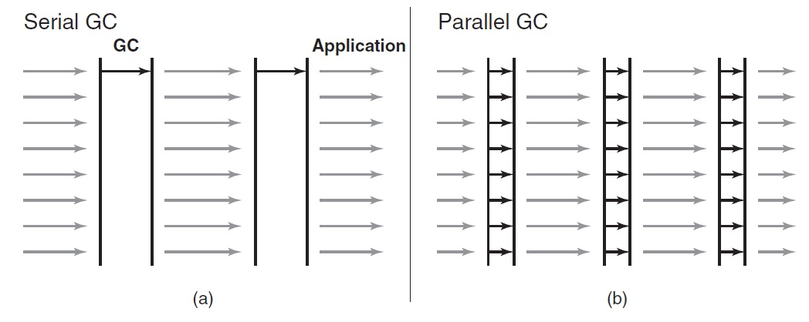

--

### Problems with Parallel GC

- Large live set
- Compaction is slow

--

### Compaction


--

### G1GC

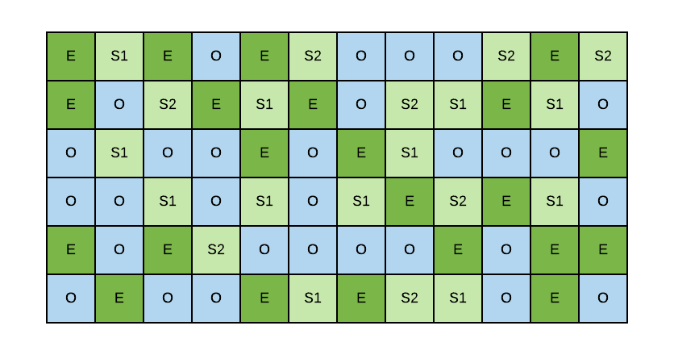

--

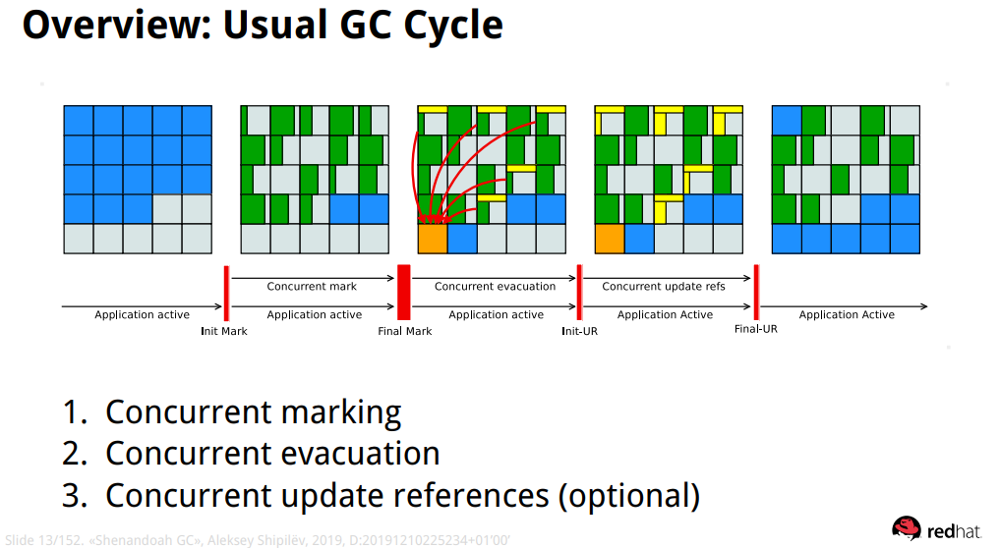

--

### ZGC & Shenandoah

- Low pause-time collectors
- Concurrent evacuation
  - Achieved by inserting barrier code
  - Impacts throughput sometimes (0-20%)
- Not generational (as of JDK 17)

--

### Barriers

```java
void example(Foo foo) {
  Bar b1 = foo.bar;             // Read
  while (..) {
    Baz baz = b1.baz;           // Read
    b1.x = makeSomeValue(baz);  // Write
}
```

--

### Barriers

```java
void example(Foo foo) {
  Bar b1 = readBarrier(foo).bar;             // Read
  while (..) {
    Baz baz = readBarrier(b1).baz;           // Read
    X value = makeSomeValue(baz);
    writeBarrier(b1).x = readBarrier(value); // Write
}
```

---

## Recommendations

What (if anything) should you do?

--

### #1: Use latest java

20-40% improvement in latency and throughput from JDK 8 to 17.

--

### Benchmarks

*Warning!* These benchmarks are extreme use-cases.
In normal use-cases, there is little to no difference.

--

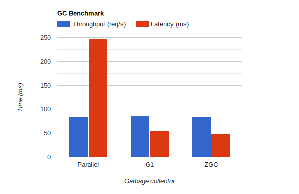 <!-- .element: height="500" -->

Note:
This is a spring boot benchmark with high allocation rate.  
Latency is max latency.  
G1 and Shenandoah similar because of web overhead.  
This does not represent your application.

--

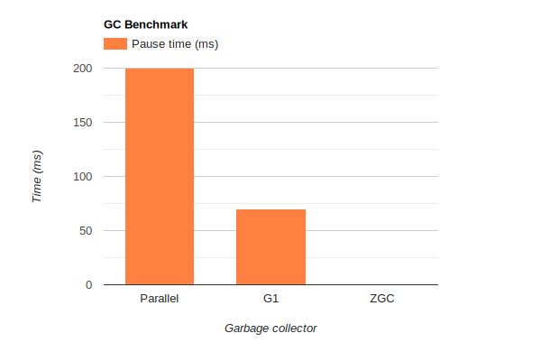 <!-- .element: height="500" -->

--

### #2: When to change GC

<!-- .slide: class="fragmented-lists" -->
- G1 (default) is probably fine
- Batch process, >1s pause times ok? `-XX:+UseParallelGC`
- pause times <200ms not good enough? `-XX:+UseZGC` or `-XX:+UseShenandoahGC`
  - Reacting to high-frequency sensor data
  - Live feedback (dashboards, trackers, websockets)
  - Games and game servers

--

### #3: Choosing a heap size

- Leave enough headroom for allocation rate
- Got reserved memory? `-Xms` = `-Xmx`

--

### #4: Diagnose problems

`-Xlog:gc` or even `Xlog:gc*:gc.log`

--

### Use analysis tools

 <!-- .element: height="500" -->

---

## The future

What's next for the JVM?

--

### Generational ZGC & Snenandoah

- Generational ZGC will be in JDK 21
  - `-XX:+ZGenerational`
- GenShen (generational shenandoah) still in preview

--

### JEP: Value Objects

<!-- .slide: class="fragmented-lists" -->
- Create objects without identity (a == b)
- Faster field access
- Better performance in JIT and GC
- Better cache utilization

---

## Thank you!

Please visit our ChilIT stand. Let's talk about JVM.  
Try the hot sauce challenge.
