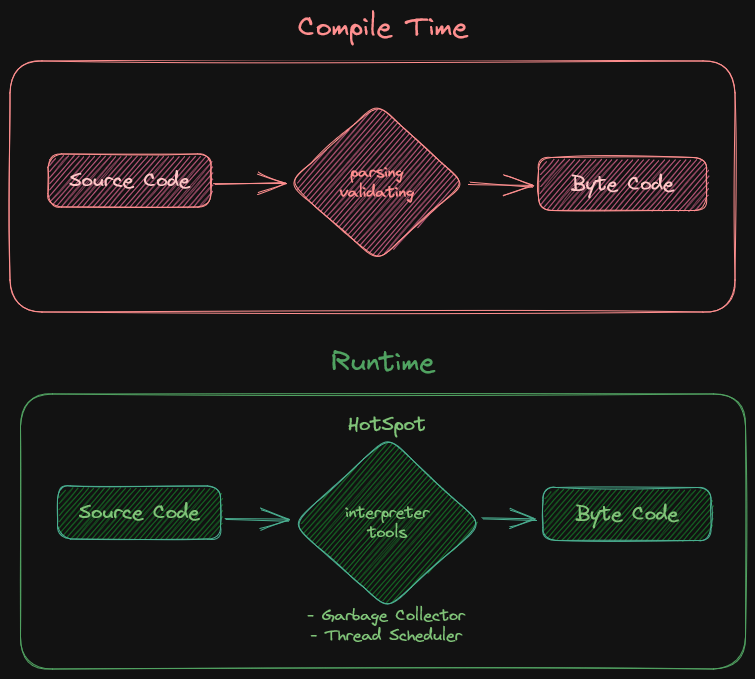
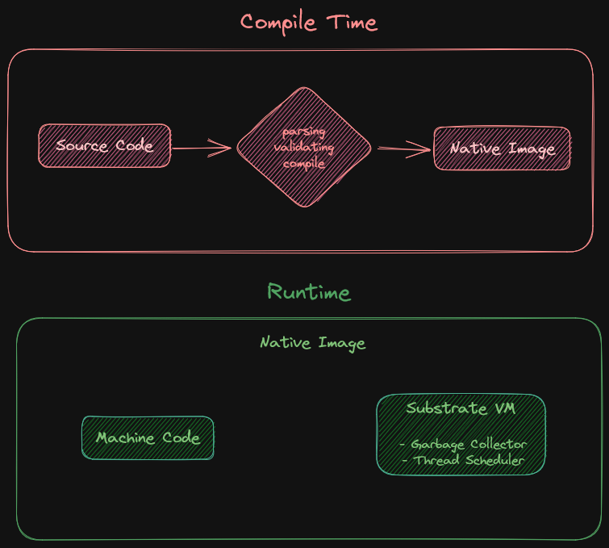
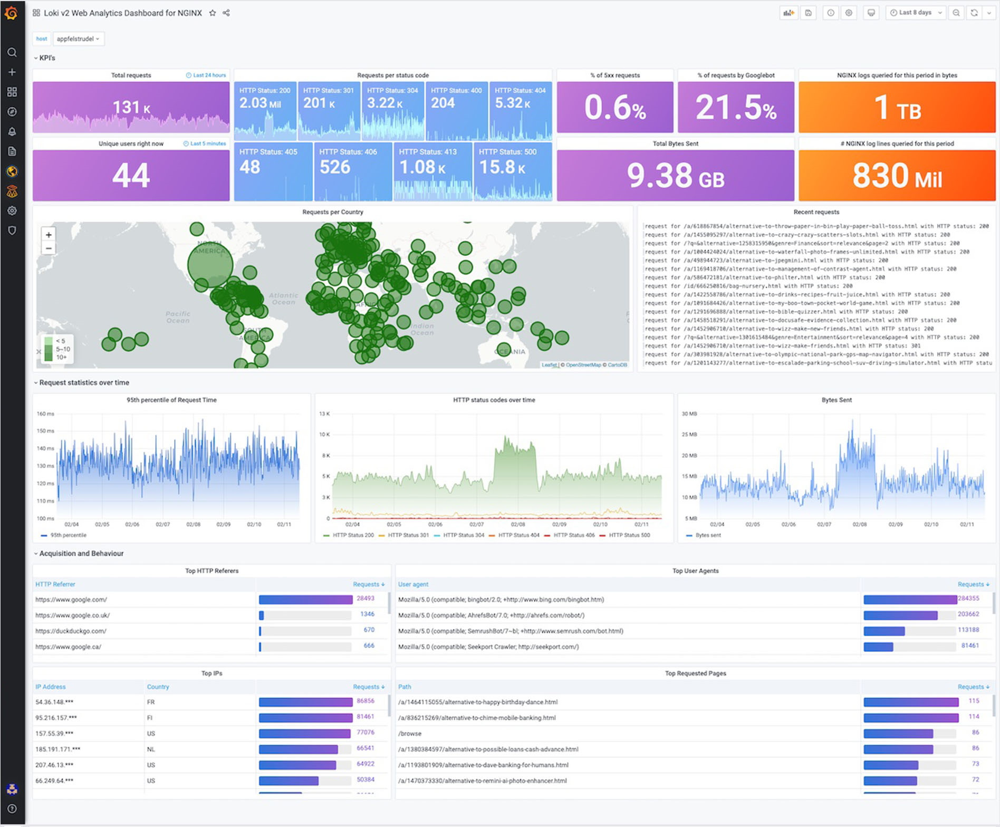
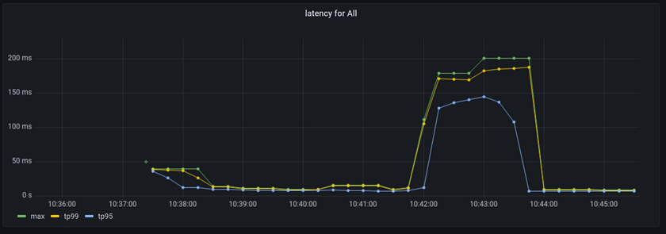

## Spring Boot 3 / Spring 6 <!-- .element: style="margin-bottom: 300px" -->
What's new?
<!-- .slide: data-background-image="pexels-lenin-estrada-2569997.jpg" -->

---

<div style="display: flex; gap: 50px">
  
  <div style="display: flex; flex-direction: column; justify-content: center; text-align: left;">
    <div>
      Lennart ten Wolde<br />
      Software Engineer, CHILIT
    </div>
    <div style="margin-top: 50px">
      KPN IoT<br/>
      Backend Java Development
    </div>
  </div>
</div>

---

## Agenda

<!-- .slide: class="fragmented-lists" -->
- Breaking changes
- Migrating **your** project
- Native image support with GraalVM
- RFC 7807 problem details
- Observability
- HTTP interface client

---

## Breaking Changes

- Java 17 minimal requirement
- Jakarta EE9
- Downstream dependencies

--

## Java 17

<!-- .slide: class="fragmented-lists" -->
- Dropped support for Java 8 and 11
- Removal of `java.se.ee`
- Dependency compatibility

--

## Jakarta EE9

<!-- .slide: class="fragmented-lists" -->
- Rebranded from Java EE
- Package relocation: `javax.*` to `jakarta.*`
- New managed dependencies (`*-jakarta`)
- Check your `pom.xml` / `build.gradle`

--

---

## Migrating

Automatically rewriting your code with OpenRewrite using Spring Boot Migrator.

--

<iframe width="640" height="480" src="https://www.youtube.com/embed/RKXblzn8lFg" title="Spring Boot 3 Upgrade Report and migration with Spring Boot Migrator" frameborder="0" allow="accelerometer; autoplay; clipboard-write; encrypted-media; gyroscope; picture-in-picture; web-share" allowfullscreen></iframe>

---

## Native image support
With GraalVM

--

### Background

 <!-- .element: height="500" -->

--

### Native image

 <!-- .element: height="500" -->

--

### Ahead of Time

Doing as much as possible ahead of (run)time
<!-- .slide: class="fragmented-lists" -->
- Generating machine code
- Generating initializer code
- Other startup bottlenecks

--

### GraalVM

<!-- .slide: class="fragmented-lists" -->
Java VM based on HotSpot/OpenJDK
- Supports Ahead-of-time (AOT) complilation
  - Finds reachable code through agressive static analysis
  - Compiles java bytecode to native executable
  - Create native images
- Unreachable code is not compiled

--

### Spring AOT Engine

Optimizing your java bytecode for static analysis
<!-- .slide: class="fragmented-lists" -->
- Integrated in build tools (maven/gradle)
- Analyzing your application context
- Generating code to manually reconstruct context
- Without runtime classpath scanning

--

### Why native?

<!-- .slide: class="fragmented-lists" -->
- Lower memory footprint
- Fast startup
  - Under 0.1 seconds
  - More agressive auto-scaling
  - Scale down to zero*

--

### Are jars being replaced?

<!-- .slide: class="fragmented-lists" -->
- No
- Native executable do not **replace** JVM apps
- They extend the number use-cases for spring

--

### Is it ready?

<!-- .slide: class="fragmented-lists" -->
- Yes!
- No additional configuration needed
  - In most cases
- Public repository with reachability data
- Tooling will only improve going forward

---

### Building a native image

Building:
```bash
mvn -Pnative spring-boot:build-image
# OR
gradle bootBuildImage
```

Running:
```bash
docker run --rm docker.io/library/demo-spring-app:VERSION
```

---

## RFC 7807 problem details
Standardized machine-readable details of errors in a HTTP response.

--

### Custom error responses in spring

```java [1-3|4|6-11]
@Transactional
@PostMapping("/todos/{project}")
public void postTodo(@PathVariable String project, @RequestBody Todo todo) {
    List<Todo> todos = todoRepository.findAllByProject(project);

    if (todos.size() >= MAX_ITEMS_PER_PROJECT) {
        throw new ResponseStatusException(HttpStatus.BAD_REQUEST, String.format(
            "Todos in project %s exceed maximum of %s",
            project, MAX_ITEMS_PER_PROJECT
        ));
    }

    // save to db...
}
```

--

### What spring returns
```json
{
   "error" : "Bad Request",
   "path" : "/todos/chores",
   "status" : 400,
   "timestamp" : "2022-11-03T12:00:00.000+00:00"
}
```
* Not very useful to the client <!-- .element: class="fragment" -->

--

### What do you do?

<!-- .slide: class="fragmented-lists" -->
- Define a custom error DTO
- Communicate with your API consumers
- Document with OpenAPI

--

### RFC 7807 problem details

<!-- .slide: class="fragmented-lists" -->
- Standardized error format
- Self-documenting
- Extendable

--

### Example

```json [|1-3|6|7|8|9|10-12]
HTTP/1.1 403 Forbidden
Content-Type: application/problem+json
Content-Language: en

{
    "type": "https://example.com/probs/out-of-credit",
    "title": "You do not have enough credit.",
    "detail": "Your current balance is 30, but that costs 50.",
    "instance": "/account/12345/msgs/abc",
    "balance": 30,
    "accounts": ["/account/12345",
                 "/account/67890"]
}
```

Note:
Here is an example of a problem response from the specification
- Here is the typical HTTP response head with a faulty error code
  - The content type is `application/problem` with JSON encoding in this case
  - You also specify the content language of the response
- The type explains the type of error, a URI that informs the consumer on how to handle the error
- A title to explain the type of error, this should not be used to derive the error type, use the `type` property for that.
- The detail explains the specifics of this instance of the error to the customer
- The instance is a URI reference to where the problem occurred
- Extra fields that can be used by the client after dericing the problem type

--

### Using problems in Spring 6

```java
@ControllerAdvice
public class ControllerExceptionHandler extends ResponseEntityExceptionHandler {
}
```

Note:
Getting started with problems is easy, just create a new controller device
for handling exceptions on all your controllers and extend `ResponseEntityExceptionHandler`

This will automatically handle Spring MVC errors as problems

--

### Default error handling

```json
{
   "instance" : "/todos/chores",
   "status" : 400,
   "title" : "Bad Request",
   "type" : "about:blank"
}
```

Note:
Because our previous code uses a Spring MVC exception, namely `ResponseStatusException`, it will now use the problems spec.

Unfortunately, out of the box, that isn't much better for custom errors

--

### Customizing the problem

```java [5-15|6|7-8|9|10-13|14]
@Transactional
@PostMapping("/{project}")
public void postTodo(@PathVariable String project, @RequestBody Todo todo) {
    List<Todo> todos = todoRepository.findAllByProject(project);
    if (todos.size() >= MAX_ITEMS_PER_PROJECT) {
        ProblemDetail problemDetail = ProblemDetail.forStatus(BAD_REQUEST);
        problemDetail.setType(
            URI.create("https://example.com/problems/todo-max-exceeded"));
        problemDetail.setTitle("Max items per project exceeded");
        problemDetail.setDetail(String.format(
            "Todos in project '%s' exceed maximum of %s",
            project, MAX_ITEMS_PER_PROJECT
        ));
        throw new ErrorResponseException(BAD_REQUEST, problemDetail, null);
    }
}
```

--

### Customizing the problem

```json
{
   "type" : "https://example.com/problems/todo-max-exceeded",
   "title" : "Max items per project exceeded",
   "status" : 400,
   "detail" : "Todos in project 'chores' exceed maximum of 10",
   "instance" : "/todos/chores"
}
```

--

### Using a custom exception

```java
public class TooManyItemsException extends ResponseStatusException {
    private final String project;
    private final int maxItems;
    
    public TooManyItemsException(String project, int maxItems) {
        super(HttpStatus.BAD_REQUEST);
        this.project = project;
        this.maxItems = maxItems;
    }

    public String getProject() {
        return project;
    }

    public int getMaxItems() {
        return maxItems;
    }
}
```

--

### Custom exception handler

```java [|4-7|8-15]
@ControllerAdvice
public class ControllerExceptionHandler extends ResponseEntityExceptionHandler {

    @ExceptionHandler(TooManyItemsException.class)
    public ProblemDetail handleTooManyItemsException(
        TooManyItemsException exception
    ) {
        ProblemDetail problemDetail = ProblemDetail.forStatus(BAD_REQUEST);
        problemDetail.setType(
            URI.create("https://example.com/problems/todo-max-exceeded"));
        problemDetail.setTitle("Max items per project exceeded");
        problemDetail.setDetail(String.format(
            "Todos in project %s exceed maximum of %s",
            exception.getProject(), exception.getMaxItems()
        ));
        return problemDetail;
    }
}
```

--

### Custom exception in controller

```java [6-8]
@Transactional
@PostMapping("/{project}")
public void postTodo(@PathVariable String project, @RequestBody Todo todo) {
    List<Todo> todos = todoRepository.findAllByProject(project);

    if (todos.size() >= MAX_ITEMS_PER_PROJECT) {
        throw new TooManyItemsException(project, MAX_ITEMS_PER_PROJECT);
    }

    // save to db...
}
```

---

## Observability

A new feature of micrometer introduced in Spring Boot 3

--

### Monitoring

 <!-- .element: height="500" -->

--

### Application monitoring

<!-- .slide: class="fragmented-lists" -->
- Logging
- Metrics
  - error rates, throughput, latency
- Tracing

--

### Interfacing in spring

<!-- .slide: class="fragmented-lists" -->
- Logging: SLF4j
- Metrics: Micrometer
- Tracing: ~~Spring Cloud Sleuth~~ -> Micrometer Tracing

--

### Micrometer Observability

- One API to rule them all *(kind of)* <!-- .element: class="fragment" -->
- Metrics, tracing and log correleration <!-- .element: class="fragment" -->
- Multiple underlying implementations <!-- .element: class="fragment" -->

--

### Integration in spring

<!-- .slide: class="fragmented-lists" -->
- Automated instrumentation of RestTemplate
- Spring MVC auto-configuration

--

### Example dashboard

 <!-- .element: height="500" -->

--

### Example dashboard



--

### API Example

```java [|2|3-4|5|6-9]
Observation.createNotStarted("todo-list.update", registry)
    .contextualName("update-todo-list")
    .lowCardinalityKeyValue("project", "chores")
    .lowCardinalityKeyValue("action", "add-item") // or "close-item", "reopen-item"
    .highCardinalityKeyValue("title", "Clean the bathroom")
    .observe(() -> {
        log.info("Saving todo item to db");
        todoRepository.save(todo);
    });
```

Note: 
- contextual name
- low cardinality keys
  - Few keys (enums, endpoint, etc.)
  - Used for metrics
- high cadrinality keys
  - Many keys (userId, other identifiers, etc.)
  - Used for tracing

---

## Java interface clients

<!-- .slide: class="fragmented-lists" -->
- Define an interface for a HTTP API
- Spring implements it for you (like Data Repositories)
- Use with WebFlux WebClient backend
- Blocking and non-blocking

--

### Defining the interface

```java
public interface TodoClient {
    @GetExchange("/todos/{project}")
    List<Todo> getTodos(@PathVariable String project);

    @PostExchange("/todos/{project}")
    void postTodo(@PathVariable String project, @RequestBody Todo todo);
}
```

Note:
Similar to OpenFeign
More aligned with spring terminology

--

### Configuring the client
```java [1-8|10-13]
@Bean
public HttpServiceProxyFactory httpServiceProxyFactory(
    WebClient.Builder webClientBuilder
) {
    WebClient webClient = webClientBuilder.baseUrl("http://localhost:8080")
        .build();
    return new HttpServiceProxyFactory(WebClientAdapter.forClient(webClient));
}

@Bean
public TodoClient todoClient(HttpServiceProxyFactory httpServiceProxyFactory) {
    return httpServiceProxyFactory.createClient(TodoClient.class);
}
```

--

### Using the client
```java
@Autowired
private TodoClient todoClient;

public void useClient() {
  todoClient.postTodo("chores", new Todo("Clean the bathroom", false));
}
```

---

## Thanks for your attention

<!-- .slide: class="fragmented-lists" -->
- Please rate my session in the app
- Visit our ChilIT stand