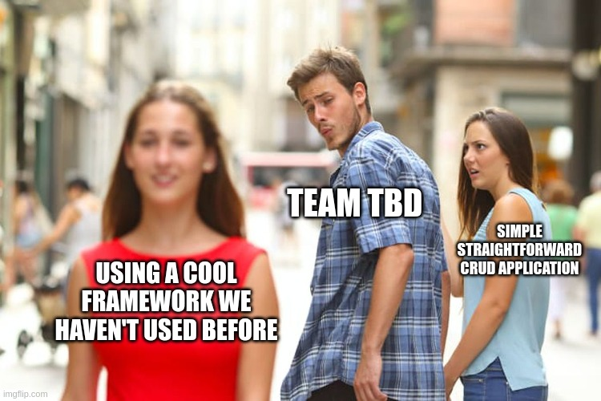
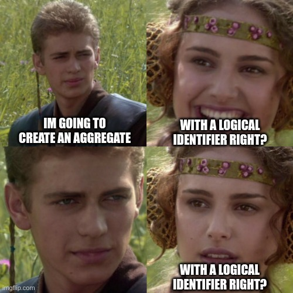
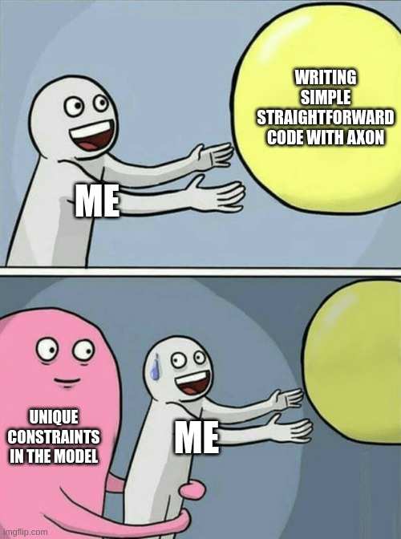

# A wild application appeared

---

## Connector MQTT

* Configuring MQTT accounts
    * CRUD REST API
* Messaging with MQTT accounts

---

## Why event sourcing

* KPN IoT is moving to an event driven architecture
    * Data is going to be thought out as events anyway
* Fits nice with audit logging

---

## Why event sourcing



---

## Domain

```
MqttAccount{
    urn: String, Identifier, Unique
    username: String, Unique
    password: String
    thingsClientId: String
    metadata: Map<String, Object>
}
```

Other fields are omitted :)

---

## Rest

* Straightforward create, read, delete
* Update using [JSON Patch](https://jsonpatch.com/)

```javascript
[
    {"op": "replace", "path": "/baz", "value": "boo"},
    {"op": "add", "path": "/hello", "value": ["world"]},
    {"op": "remove", "path": "/foo"}
]
```

---

## Command model

* Aggregate
* Commands
* Events


---


## Aggregate



---

## Aggregate

* Aggregate identifiers are single-use:
    * Delete once, reuse never
* URNs should be reusable
    * e.g. returning customer that deleted their previous account

Note:
Single-use is logisch, anders heb je meerdere event reeksen voor id 'x' die over andere objecten gaan.
Wel vervelend als een id herbruikbaar moet zijn

---

## Aggregate identifier: Our solution


---

## Aggregate

```java

@Aggregate
public class Account {
    private @AggregateIdentifier UUID id;
    private String urn;
    private String username;
    private String passwordHash;
    private String thingsClientId;
    private Map<String, Object> metadata;
}
```

---

## Commands

```java

public sealed interface AccountCommand {
    record Create(
        @TargetAggregateIdentifier UUID id,
        String urn,
        String username,
        String password,
        String thingsClientId,
        Map<String, Object> metadata
    ) implements AccountCommand {}

    record Patch(
        @TargetAggregateIdentifier UUID id,
        ProposedAccountPatch patch, // result of applying json patch to patchable fields
        String password
    ) implements AccountCommand {}

    record Delete(@TargetAggregateIdentifier UUID id) implements AccountCommand {}
}

```

---

## Events

```java 
public sealed interface AccountEvent {
    record Created(
        UUID id,
        String urn,
        String thingsClientId,
        String username,
        String passwordHash,
        Map<String, Object> metadata
    ) implements AccountEvent {}

    record Deleted(UUID id) implements AccountEvent {}

    record CredentialsUpdated(UUID id, String username, String passwordHash) implements AccountEvent {}

    record MetadataUpdated(UUID id, Map<String, Object> metadata) implements AccountEvent {}

    // Update events for fields we didn't tell you about
    record FlowUpdated(UUID id, Flow flow) implements AccountEvent {}

    record UplinkEnabledUpdated(UUID id, boolean uplinkEnabled) implements AccountEvent {}

    record DownlinkEnabledUpdated(UUID id, boolean downlinkEnabled) implements AccountEvent {}

    record ExpiryUpdated(UUID id, Instant expiry) implements AccountEvent {}
}
```

Note:

Don't use jsonpatch in the events, don't bother your consumers with that and just tell them what changed.

---

## Query Model

* Projection


```java
public record AccountProjection(
    @Id UUID id,
    String urn,
    String thingsClientId,
    String username,
    String passwordHash,
    ObjectNode metadata
) {}
```

* Projector
    * listens to events to create, update and delete the projection
* Database

---

## Query model


---

## Cool, are we done?

No.

---



---

## Unique constraints

* Validation within a single aggregate is easy
* Unique constraints covering multiple aggregate instances on the other hand...
    * immediately consistent lookup tables
    * own 'projectors'
    * part of command model

```sql
CREATE TABLE urn_lookup
(
    account_id UUID    NOT NULL PRIMARY KEY,
    urn        VARCHAR NOT NULL UNIQUE
);
```

---

## Eventual consistency is weird

Let's create an account using the HTTP endpoint and retrieve it afterwards using the location provided in the location
header. *SLAP* `404` to the face!

---

## Eventual consistency is weird


---

## Streaming (eventual) vs Subscribing (immediately) 

* Streaming -> Different thread
  * Can be part of the Query Domain
  * Does not influence command _sourcing_ handling
* Subscribing -> Same Thread
  * Part of the Command domain
  * Can influence event _sourcing_ handling

---

## Evaluation


---

## Evaluation

* More experience with event driven and event sourcing
* Held back by current event system in Kpn IoT
* Fruits of labor will show when we can make use of the events
