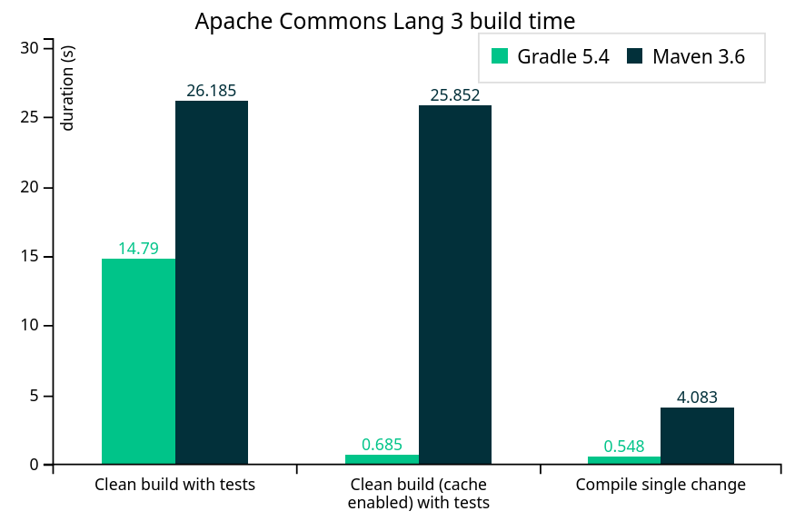

<!-- .slide: data-background-image="Template_01.jpg" -->

---

## Gradle + Kotlin DSL <!-- .element: style="margin-bottom: 300px" -->
Because life's too short for messy builds
<!-- .slide: data-background-image="pexels-lenin-estrada-2569997.jpg" -->

---

<div style="display: flex; gap: 50px">
  
  <div style="display: flex; flex-direction: column; justify-content: center; text-align: left;">
    <div>
      Lennart ten Wolde<br />
      Software Engineer, ChilIT
    </div>
    <div style="margin-top: 50px">
      KPN IoT<br/>
      Backend Java Development
    </div>
  </div>
</div>

---

## Who is this talk for

<!-- .slide: class="fragmented-lists" -->
- Never used gradle
- Used gradle but currently something else
- Using gradle, but not the latest features
- Gradle power-users looking for an ego boost

---

## Agenda

<!-- .slide: class="fragmented-lists" -->
- History of build tools
- What is gradle
- The power of gradle 8
- Why use gradle + kotlin?

---

<!-- .slide: class="fragmented-lists" -->
## History of build tools

- Shell scripts
- Makefile
- NPM

--

### NPM

```json
{
  "name": "my-app",
  "version": "1.0.0",
  "main": "index.js",
  "scripts": {
    "build": "some bundler cmd",
  },
  "dependencies": {
    "express": "^4.17.1"
  }
}
```

```sh
$> npm install lodash
```
<!-- .element: class="fragment" -->

--

### Maven & Gradle

<!-- .slide: class="fragmented-lists" -->
- XML (pom.xml) and DSL (build.gradle)
- Dependency management
  - Maven repositories
- Automated testing and reporting
- Publishing artifacts
- Modular and extendable

---

## What is gradle?

<!-- .slide: class="fragmented-lists" -->
- Gradle is a build automation tool
- Hierarchy of tasks
- Tasks are created and configured via DSL
- Reusable build logic via plugins

--

### Task hierarchy


Note:
- Gradle tasks form a graph from their dependencies
- The graph is created at the start from your gradle build files

--

### Making builds

`build.gradle.kts`:
```gradle
tasks.register("hello") {
    doFirst {
        println("Hello")
    }
    println("J-Fall")
}

println("2023!")
```

--

### Executing builds!

```console
$ gradle hello

> Configure project :
2023!
J-Fall

> Task :hello
Hello
```

Note:
Execution order: init -> configure -> execute

--

### More tasks

```kt [|7|9|1,10|11]
tasks.register("hello") {
    doFirst {
        println("Hello J-Fall")
    }
}

val message = findProperty("message") ?: "Hello"

tasks.register("cowsay", Exec::class) {
    dependsOn("hello")
    commandLine("cowsay", message)
}
```

--

### More tasks

```console
$ gradle cowsay -Pmessage="Hello nerds"

> Task :hello
Hello J-Fall

> Task :cowsay
 _____________ 
< Hello nerds >
 ------------- 
        \   ^__^
         \  (oo)\_______
            (__)\       )\/\
                ||----w |
                ||     ||
```

--

### More tasks

```kt [3-4]
tasks.register("cowsay", Exec::class) {
    dependsOn("hello")
    group = "Build"
    description = "Print a message via cowsay"
    commandLine("cowsay", message)
}
```

--

### More tasks

```console [|15-16]
$ gradle tasks

> Task :tasks

------------------------------------------------------------
Tasks runnable from root project 'minimal'
------------------------------------------------------------

Build tasks
-----------
cowsay - Print a message via cowsay

Build Setup tasks
-----------------
init - Initializes a new Gradle build.
wrapper - Generates Gradle wrapper files.
```

--

## Gradle CLI

- Useful for creating new projects
- Versions not (fully) backwards-compatible
- Gradle wrapper

--

### New project

```console [1|3-8|10-17|19-23|25-30|32-35]
$ gradle init

Select type of project to generate:
  1: basic
  2: application
  3: library
  4: Gradle plugin
Enter selection (default: basic) [1..4] 2

Select implementation language:
  1: C++
  2: Groovy
  3: Java
  4: Kotlin
  5: Scala
  6: Swift
Enter selection (default: Java) [1..6] 3

Generate multiple subprojects for application? (default: no) [yes, no] no
Select build script DSL:
  1: Kotlin
  2: Groovy
Enter selection (default: Kotlin) [1..2] 1

Select test framework:
  1: JUnit 4
  2: TestNG
  3: Spock
  4: JUnit Jupiter
Enter selection (default: JUnit Jupiter) [1..4] 4

Project name (default: basic-app): 
Source package (default: basic.app): 
Enter target version of Java (min. 7) (default: 21): 21
Generate build using new APIs and behavior (some features may change in the next minor release)? (default: no) [yes, no] no
```

--

### Project structure

```console [|3-6|6,12|18-23|20-21|24]
$ tree --charset ASCII .
.
|-- app
|   |-- build.gradle.kts
|   `-- src
|       |-- main
|       |   |-- java
|       |   |   `-- basic
|       |   |       `-- app
|       |   |           `-- App.java
|       |   `-- resources
|       `-- test
|           |-- java
|           |   `-- basic
|           |       `-- app
|           |           `-- AppTest.java
|           `-- resources
|-- gradle
|   `-- wrapper
|       |-- gradle-wrapper.jar
|       `-- gradle-wrapper.properties
|-- gradlew
|-- gradlew.bat
`-- settings.gradle.kts
```

--

### settings.gradle

```kt [|9|10]
$ cat settings.gradle.kts 
/*
 * This file was generated by the Gradle 'init' task.
 *
 * The settings file is used to specify which projects to include in your build.
 * For more detailed information on multi-project builds, please refer to https://docs.gradle.org/8.4/userguide/building_swift_projects.html in the Gradle documentation.
 */

rootProject.name = "basic-app"
include("app")
```

--

### app/build.gradle

```kt [|1-4|6-9|11-19|21-26|28-31|33-36|24,30]
plugins {
    // Apply the application plugin to add support for building a CLI application in Java.
    application
}

repositories {
    // Use Maven Central for resolving dependencies.
    mavenCentral()
}

dependencies {
    // Use JUnit Jupiter for testing.
    testImplementation("org.junit.jupiter:junit-jupiter:5.9.3")

    testRuntimeOnly("org.junit.platform:junit-platform-launcher")

    // This dependency is used by the application.
    implementation("com.google.guava:guava:32.1.1-jre")
}

// Apply a specific Java toolchain to ease working on different environments.
java {
    toolchain {
        languageVersion.set(JavaLanguageVersion.of(21))
    }
}

application {
    // Define the main class for the application.
    mainClass.set("basic.app.App")
}

tasks.named<Test>("test") {
    // Use JUnit Platform for unit tests.
    useJUnitPlatform()
}
```

--

### app/build.gradle

```kt [24,30]
plugins {
    // Apply the application plugin to add support for building a CLI application in Java.
    application
}

repositories {
    // Use Maven Central for resolving dependencies.
    mavenCentral()
}

dependencies {
    // Use JUnit Jupiter for testing.
    testImplementation("org.junit.jupiter:junit-jupiter:5.9.3")

    testRuntimeOnly("org.junit.platform:junit-platform-launcher")

    // This dependency is used by the application.
    implementation("com.google.guava:guava:32.1.1-jre")
}

// Apply a specific Java toolchain to ease working on different environments.
java {
    toolchain {
        languageVersion = (JavaLanguageVersion.of(21))
    }
}

application {
    // Define the main class for the application.
    mainClass = ("basic.app.App")
}

tasks.named<Test>("test") {
    // Use JUnit Platform for unit tests.
    useJUnitPlatform()
}
```

---

## The power of gradle 8

<!-- .slide: class="fragmented-lists" -->
- Shared build logic
- Advanced dependency management
- Performance

--

### Multi module setup

```kt
rootProject.name = "basic-app"
include("app", "lib")
```

--

### Multi module setup

- `./gradlew build`
- `./gradlew :app:run`
- `./gradlew :lib:publish`

--

### Shared build logic

```console
|-- buildSrc
|   |-- build.gradle.kts
|   |-- settings.gradle.kts
|   `-- src
|       `-- main
|           `-- kotlin
|               |-- basic.app.java-common-conventions.gradle.kts
```

--

### Shared build logic

```kt [|1-4|6-10|13-17|19-31|20-23|33-39|41-44]
plugins {
    // Apply the java Plugin to add support for Java.
    java
}

repositories {
    // Use Maven Central for resolving dependencies.
    mavenCentral()
    maven("https://oss.sonatype.org/content/repositories/snapshots/")
}

// Apply a specific Java toolchain to ease working on different environments.
java {
    toolchain {
        languageVersion.set(JavaLanguageVersion.of(21))
    }
}

dependencies {
    constraints {
        // Define dependency versions as constraints
        implementation("org.apache.commons:commons-text:1.10.0")
    }

    // LWJGL
    implementation(platform("org.lwjgl:lwjgl-bom:$lwjglVersion"))

    // Use JUnit Jupiter for testing.
    testImplementation("org.junit.jupiter:junit-jupiter:5.9.3")
    testRuntimeOnly("org.junit.platform:junit-platform-launcher")
}

tasks.withType(JavaCompile::class) {
    options.compilerArgs = listOf("--enable-preview")
}

tasks.withType(Test::class) {
    jvmArgs = listOf("--enable-preview")
}

tasks.named<Test>("test") {
    // Use JUnit Platform for unit tests.
    useJUnitPlatform()
}
```

--

### Custom tasks

```kt
abstract class MyTask : DefaultTask() {
    @get:Input
    var myProperty: String? = null

    @TaskAction
    fun run() {
        // Skipped for brevity
    }
}
```

--

### Custom tasks

```kt
tasks.register("taskName", MyTask) {
    myProperty = "Constant string value"
}
```

---

## Advanced Dependency Management

- Dependency constraints
- Version catalogs
- Feature variants

--

### Dependency constraints

```kt [1-7|9-10]
// In conventions plugin
dependencies {
    constraints {
        // Define dependency versions as constraints
        implementation("org.apache.commons:commons-text:1.10+")
    }
}

// In build.gradle.kts
implementation("org.apache.commons:commons-text")
```

--

### Version catalogs

```kt [1-11|13-14]
// In settings.gradle.kts
dependencyResolutionManagement {
    versionCatalogs {
        create("libs") {
            library("commons-lang3", "org.apache.commons", "commons-lang3").version {
                strictly("[3.8, 4.0[")
                prefer("3.9")
            }
        }
    }
}

// In build.gradle.kts
implementation(libs.bundles.commons-lang3)
```

---

## Performance



--

### Performance

<!-- .slide: class="fragmented-lists" -->
- Gradle daemon
- Incremental builds & compilation
- Virtual file system (VFS)
- Build cache
- Configuration cache
- Parallel builds

--

### Build Cache

<!-- .slide: class="fragmented-lists" -->
- Enable via `--build-cache` or in properties
- Speed up local builds by re-using outputs
  - Such as when switching branches
- Speed up CI builds and avoid running tasks twice
  - Share outputs with developers

---

## Final thoughts

Why use gradle?

--

### When not to

<!-- .slide: class="fragmented-lists" -->
- Don't rock the boat
- Comfortable with my current builds
  - Prefer executions, phases and goals over tasks
- Value stability over usability

--

### Otherwise

--

### If not for

<!-- .slide: class="fragmented-lists" -->
- Compact and concise build information
- Performance
- Ability to extend and set conventions
- Advanced (transitive) dependency management
- Elephant mascot which is way better than the letter M

Note:
- If not for
  - Compact and concise build information
  - Performance
  - Ability to extend and set conventions
  - Advanced (transitive) dependency management
  - Elephant mascot which is way better than the letter M

--

### Then because

<!-- .slide: class="fragmented-lists" -->
- Because we are not users of graphical interfaces
- We are not people who run simple commands
- We don't just edit configuration
- We are... programmers!

Note:
- Then (high energy, final word)
  - Because we are not users of graphical interfaces
  - We are not people who run simple commands
  - We don't just edit configuration
  - We are... programmers!
  - And we will program our builds, so they can have bugs too
- Thanks for your intrest please consider leaving a review
- Visit our stand

--

<!-- .slide: data-background-image="Template_end.jpg" -->
