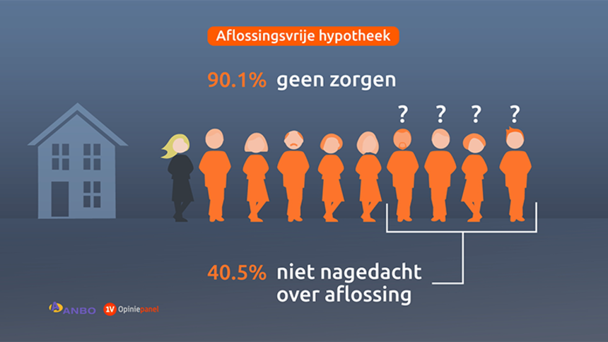
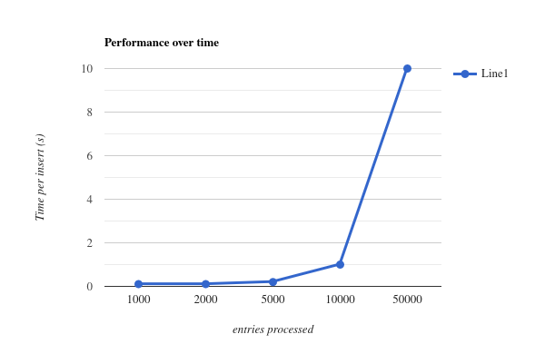

## J-Spring 2024 Keynote <!-- .element: style="margin-bottom: 300px" -->
Discovering performance bottlenecks in real world
<!-- .slide: data-background-image="intro-slide.webp" -->

---

<div style="display: flex; gap: 50px">
    
    <div style="display: flex; flex-direction: column; justify-content: center; text-align: left;">
        <div>
            Lennart ten Wolde<br /><br/>
            Software Engineer, CHILIT
        </div>
    </div>
</div>

---

## Agenda

1. Why performance matters
2. Diagnosis: What went wrong
3. Lessons for the future
4. What are performance bottlenecks?

---

## Why performance matters

--

## Interest-only mortgages


Note:


--

## Interest-only mortgages



--

### The assignment

<!-- .slide: class="fragmented-lists" -->
* Important task with broad socio-economic impact
* Time-constrained with deadline set by AFM
* Large volume of existing data
    * Originating from old mainframe adminsitration

--

## Building the batch process

<!-- .slide: class="fragmented-lists" -->
* Import mortgage entries and properties from a CSV
* Enrich with additional customer information
* Insert individual entries into AWS Aurora database

--

## Test: 1, 2, 3

--

## And we're live!

```shell
15:00:00.000 [INFO] Beginning mortgage import process
```

--

### Troubleshooting 101

<!-- .slide: class="fragmented-lists" -->
* Make an assumption and fix it
* Add logging for each entry
* Reduce logging (track status)
* Investigate suspected bottlenecks
* Increase application resources...

Note:
What do you do when there are no errors in the logs and you have no indication as to what might be wrong?
We are used to our errors telling us almost exactly what is wrong and how to fix it.

First, I did what any developer would do. Make an assumption. But it didn't work.
Then, I wanted to understand what the program is doing. You can attach a debugger, or just log what the program is doing.
But, you get overwhelmed by logging the wrong thing
So then, reduce logging frequency. Ah ha! Its getting slower!
But why?
I made a bad assumption and assumed the bottleneck was related to memory running out

--


Note:
This process can be frustrating. Especially when you are in a rush.
Just imagine if you were in the middle of a migration process between different systems or
environments, and you cannot go back!  
And because we are ill-prepared for these kinds of issues we don't know where to look.  
We don't understand our bottlenecks, we don't have insight in them, and so we shoot in the dark.

---

## Diagnosis: What went wrong?

Note:
So let's do some diagnosis. What actually went wrong here?  
Why was this process never finishing?  

--



Note:
I remember that the processing time for each new insert increased
as more and more rows were being inserted.
So while it was very fast at first, after 50,000 entries it took over 10
seconds to process a single entry!

--

```java [|4-5|7,8,10,11|1]
@Transactional
@Scheduled("0 0 15 * * *")
public void importDataFromCsv() {
    CsvReader csvReader = ...
    while(csvReader.next()) {
        MortgageRecord row = csvReader.parse(MortgageRecord.class);
        Mortgage mortgage = mortgageRepository.findById(row.id())
            .orElse(new Mortgage());
        updateMortgage(mortgage, row);
        mortgageRepository.persist(mortgage);
        mortgageRepository.flush();
    }
}
```

Note:
So this is how one might implement this, with some pseudo-code.
As an engineer you can identify several issues where you can imagine something going wrong.

Maybe the csv reader is keeping the entire file in memory and its slowing down, instead of streaming rows?

Maybe hibernate is keeping a cache of reference to all of the previously inserted rows?
Do most people even have a good idea of how hibernate functions internally anyway? I surely did not back then.

But in this case, the main issue was with the use of this Transactional annotation.
It makes sense on the surface. If the process fails roll back everything. And one transaction should be faster than auto-commit for each insert.
But we are also searching for existing entries each time we process a new row!

--

## Solution

<!-- .slide: class="fragmented-lists" -->
* Transaction per row
* **Should** have taken 5 minutes to solve

Note:
So what we had to do in this case.
Was move the place where we create a transaction so that each row runs in its own transaction.
This prevents slowing down the database as it grows with new entries being added, only becoming
an issue as we approach 100,000 entries in the database, way more than we ever tested with!

--

```java[|5,12]
@Scheduled("0 0 15 * * *")
public void importDataFromCsv() {
    CsvReader csvReader = ...
    while(csvReader.next()) {
        transactionTemplate.doInTransactionWithoutResult(status -> {
            MortgageRecord row = csvReader.parse(MortgageRecord.class);
            Mortgage mortgage = mortgageRepository.findById(row.id())
                .orElse(new Mortgage());
            updateMortgage(mortgage, row);
            mortgageRepository.persist(mortgage);
            mortgageRepository.flush();
        }
    }
}
```

--

### Fixing more bottlenecks

<!-- .slide: class="fragmented-lists" -->
* Bottleneck is now networking IO to database
* Use batch inserts
    * With batch select queries for updating
* Utilize concurrency
    * Be careful not to exhaust connection pool
    * Apply backpressure

Note:
This is not the ideal solution. And probably not what I would do today.
But it was enough at the time to meet our performance needs and deadlines.

The bottleneck has changed from a technical issue around the use of @Transactional to now
being the networking between the applicaiton in database throughout its various queries.
Each time a query is executed the application waits for a response from the DB.

You can improve this by utilizing batch inserts, inserting several hundred entries in a single query.
When you do this though, it adds some complexity because we want to update existing entities, which will have
to be queried first in a batch select query, and then upserted.

Finally you can utilize concurrency to allow multiple of these batch operations to take place at the same time,
further reducing the impact of the database round trip.
This does have diminishing returns due to actual database bottlenecks and some pitfalls to avoid.
Such as using up your limited pool of database connections by accident or not applying backpressure when you
queue up the entries imported from the CSV and offer them to a set of worker threads, resulting in the entire
CSV being loaded in memory.

---

## Lessons for the future

<!-- .slide: class="fragmented-lists" -->
* Be careful about how you use transactions
* Test with realistic workloads before going to production
* Collect plenty of useful metrics for quick diagnosis

---

## Bottlenecks in software


--

## Hierarchy of bottlenecks

 <!-- .element: height="500" -->

--

### There is always a bottleneck

<!-- .slide: class="fragmented-lists" -->
* Have a good understanding of where bottlenecks are
* Eliminate bottlenecks until you reach a performance target
* Don't prematurely optimize
* But do: Stay one step ahead of your next production issue

---

## Thank You!

<!-- .slide: class="fragmented-lists" -->
* Visit the break-out session for more information
  * More complex examples
  * Diagnostic tools and profilers
  * Performing load tests
* Visit the ChilIT stand

Note:
If you want to know more about this topic,
explore different kinds of performance bottlenecks commonly found in practice,
learn how to diagnose issues quickly,
get an idea of issues you might encounter by performing load tests
and profiling your own code,
Visit our break-out session at XX:YY

Also come and say hi to us at our ChilIT stand,
do our programming challenge and talk to us
about the keynote or anything else related to programming or J-Spring.
