## Are you addicted to your framework? I was too, let's go to rehab together.

---


<!--* Connection to SOLID principles
* Separate components that change for different reasons (SRP)
* Connection to DIP-->

---

<div style="display: flex; gap: 50px">
    
    <div style="display: flex; flex-direction: column; justify-content: center; text-align: left;">
        <div>
            John Sterken<br />
            Software Engineer<br />
            <br/>
            
        </div>
    </div>
</div>

---

## Should I abandon my framework altogether?

<!-- .slide: class="fragmented-lists" -->
* Of course not; frameworks are great!
* But stay SOLID

---

## Why is this important?

<!-- .slide: class="fragmented-lists" -->
* As developers, we are all architects
* Maximize decisions not made
* Single reason for change (SRP)
<!-- * Framework dependency shuts down options -->

---

---

```java
package com.example.service;

import org.springframework.stereotype.Service;

@Service
public class SimpleService {
    private final ApiClient feignClient;
    
    public SimpleService(ApiClient feignClient) {
        this.feignClient = feignClient;
    }

    public String callExternalService() {
        return feignClient.getExternalData();
    }
}
```

---

```java
package com.example.service;

import org.springframework.stereotype.Service;
import com.netflix.hystrix.contrib.javanica.annotation.HystrixCommand;

@Service
public class SimpleService {
    // feignClient, constructor
    @HystrixCommand(fallbackMethod = "fallbackResponse")
    public String callExternalService() {
        return feignClient.getExternalData();
    }

    public String fallbackResponse() {
        return "Fallback response";
    }
}

```

---

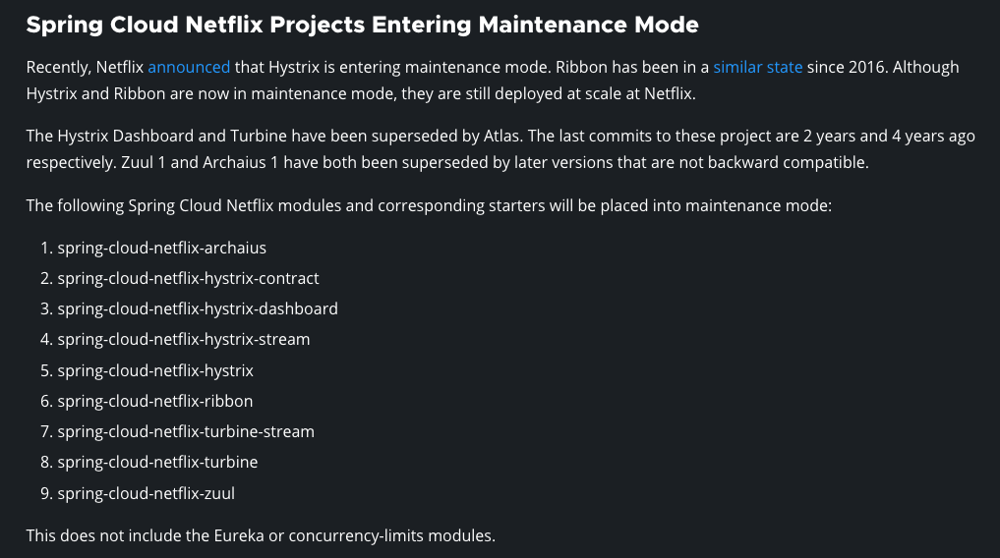

---

# Spring example application

---

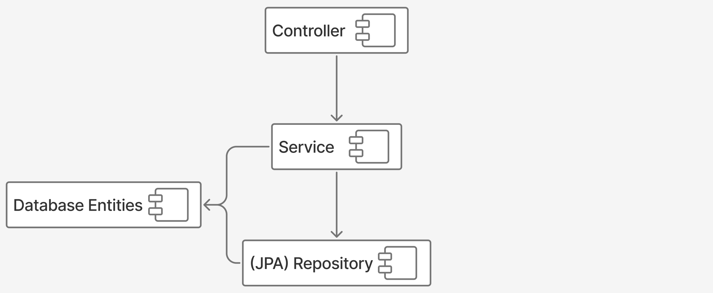

---

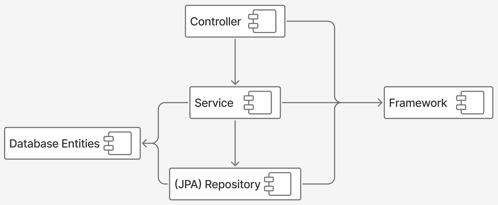

---

```java[|4|10]
package com.example.service;

...
import org.springframework.stereotype.Service;
...

@Service
@Transactional
public class SomeService {
    private final SomeRepository someRepository;

    // constructor, other methods, etc.
    
    public void doSomething() {
        SomeEntity entity = someRepository.findById(...);
        ...
    }
}
```

---

```java[|4]
package com.example.repository;

...
import org.springframework.data.jpa.repository.JpaRepository;
...

public interface SomeRepository extends JpaRepository<SomeEntity, Long> {
    // custom query methods
}
```

---

## How do we decouple?

<!-- .slide: class="fragmented-lists" -->
* Separate your core logic from the framework
* We can use the D from the SOLID principles (Dependency Inversion Principle)

---

## What is your core domain?

---

## core domain != database tables

---

## core domain == model of reality

---

## Refactored example


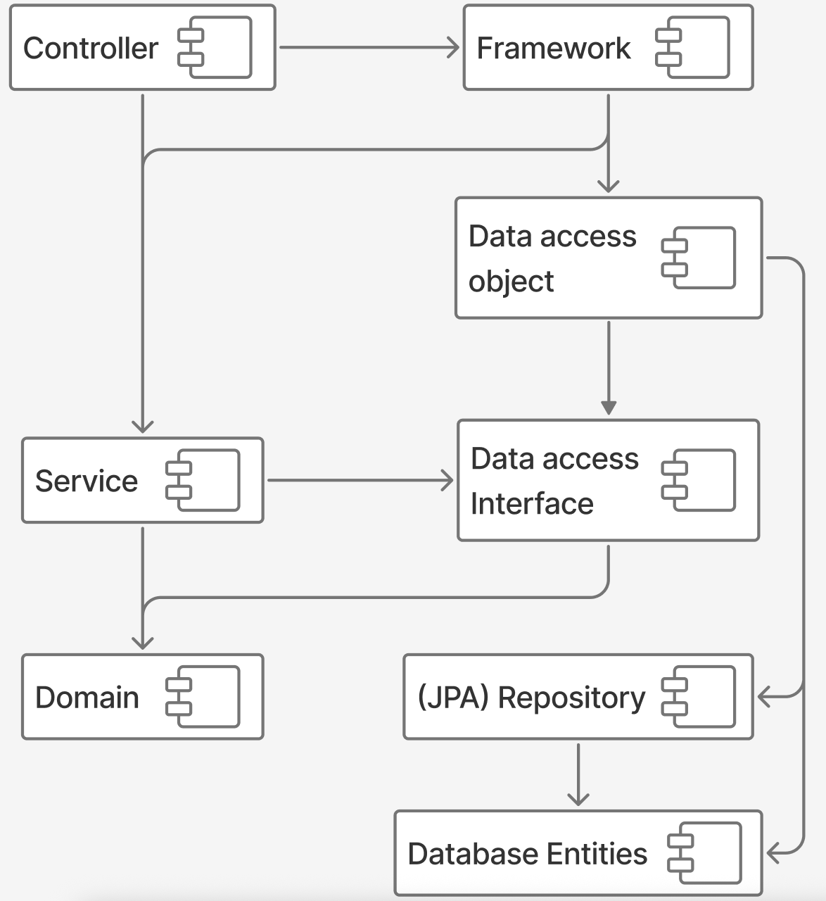

---

<div class="stretch" style="display: flex; justify-content: center; align-items: center; width: 100%">
<div style="flex-grow: 2">

```java
package com.example.domain;

// only imports that start with java

public record SomeEntity (UUID id, ...) {
}
```

</div>
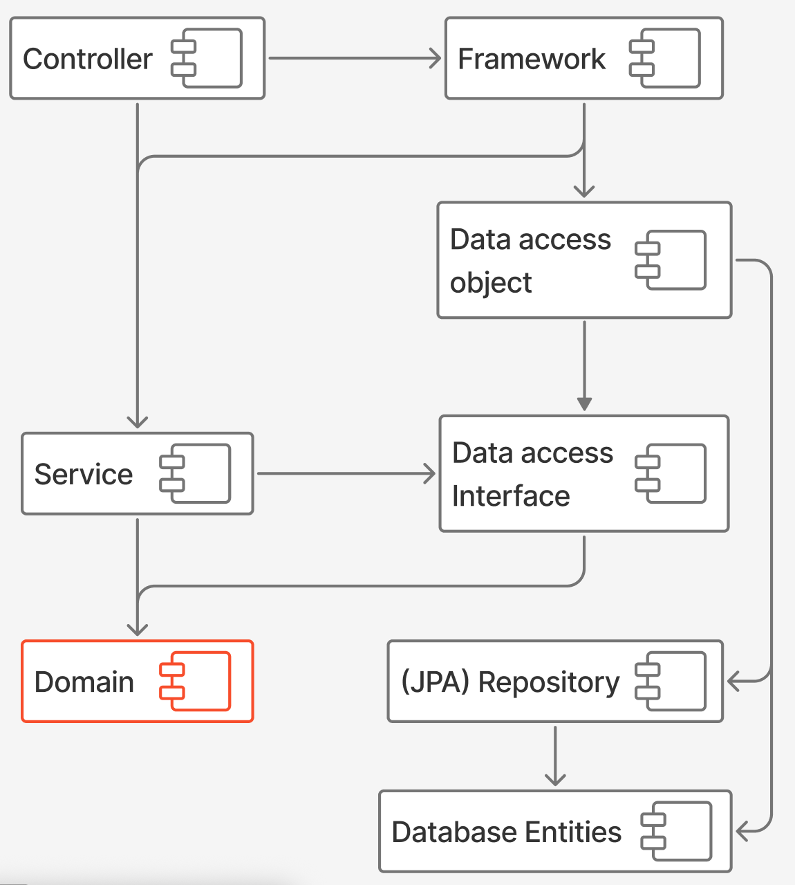
</div>

---

<div class="stretch" style="display: flex; justify-content: center; align-items: center; width: 100%">
<div style="flex-grow: 2">

```java[|3-4]
package com.example.domain.repository;

import com.example.domain.SomeEntity;
// imports from java

public interface SomeRepository {
    Optional<SomeEntity> findById(UUID id);
}
```

</div>
    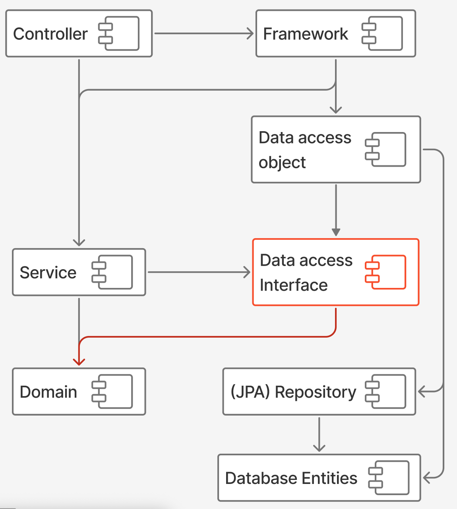
</div>

---

<div class="stretch" style="display: flex; justify-content: center; align-items: center; width: 100%">
<div style="flex-grow: 2">

```java[|3-5]
package com.example.service;

import com.example.domain.SomeEntity;
import com.example.domain.repository.SomeRepository;
// imports from java

public class SomeService {
    private final SomeRepository someRepository;

    // constructor, other methods, etc.
    
    public void doSomething() {
        SomeEntity entity = someRepository
            .findById(...);
        ...
    }
}
```

</div>
    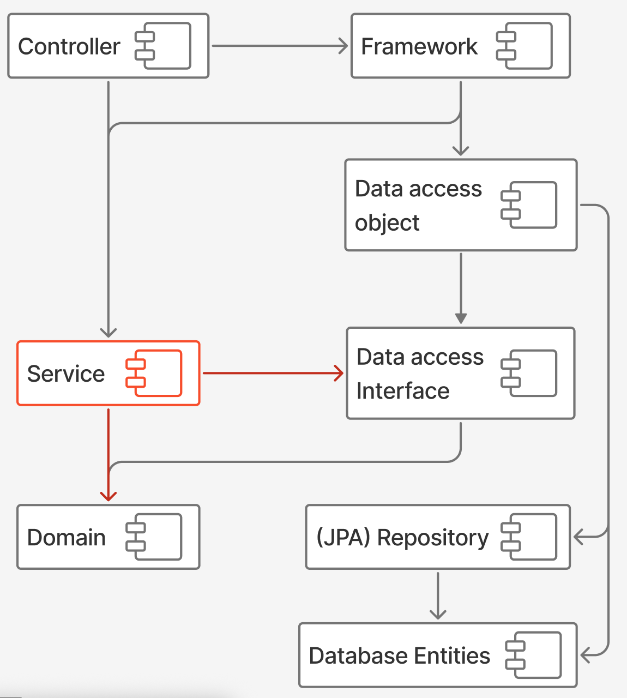
</div>

---

<div class="stretch" style="display: flex; justify-content: center; align-items: center; width: 100%">
<div style="flex-grow: 2">

```java
package com.example.jpa.repository;

// imports

public interface SomeJpaRepository
        extends JpaRepository<SomeJpaEntity, Long> {
    
    Optional<SomeJpaEntity> findById(UUID id);
    // custom query methods
}
```

</div>
    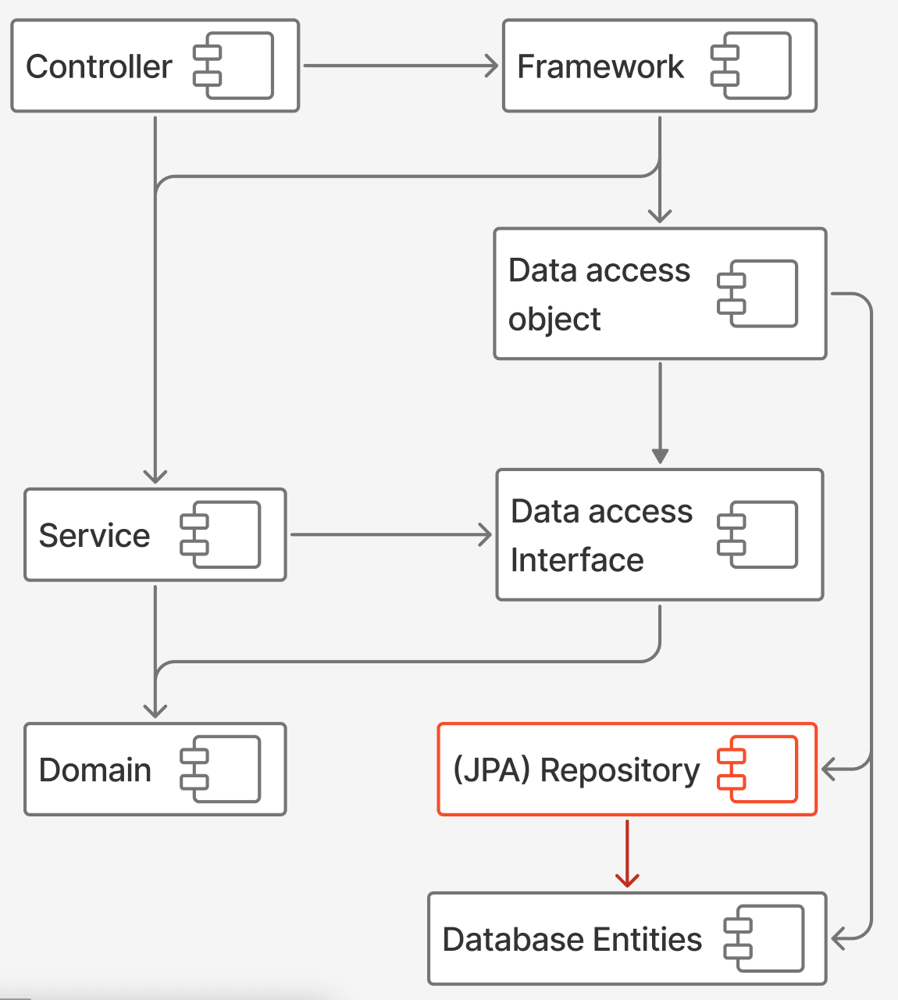
</div>

---

<div class="stretch" style="display: flex; justify-content: center; align-items: center; width: 100%">
<div style="flex-grow: 2">

```java
package com.example.jpa.entity;

// imports

@Entity
public class SomeJpaEntity {
    @Id
    @GeneratedValue
    private UUID id;

    // other fields, getters, setters, etc.
}
```

</div>
    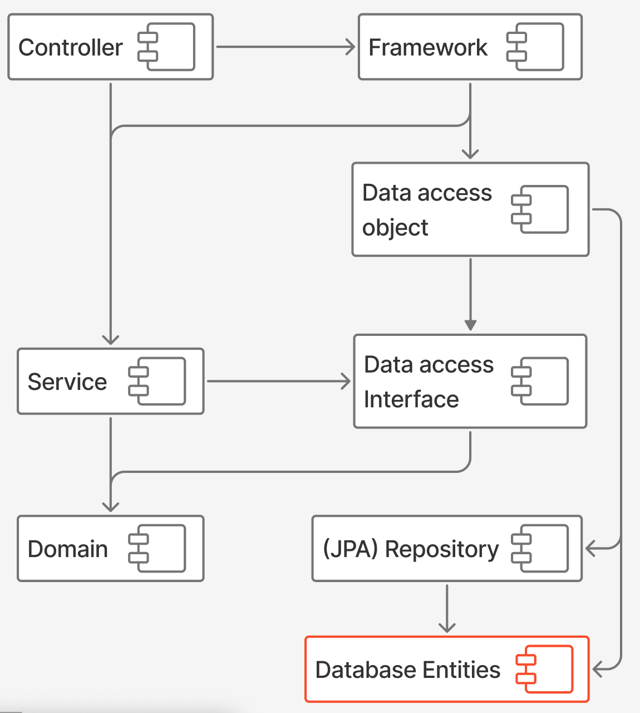
</div>

---

<div class="stretch" style="display: flex; justify-content: center; align-items: center; width: 100%">
<div style="flex-grow: 2">

```java
package com.example.jpa.dao;

// imports

public class SomeRepositoryJpaDao 
        implements SomeRepository {
    private final SomeJpaRepository someJpaRepository;

    @Override
    public Optional<SomeEntity> findById(UUID id) {
        return someJpaRepository.findById(id)
            .map(...);
    }
}
```

</div>
    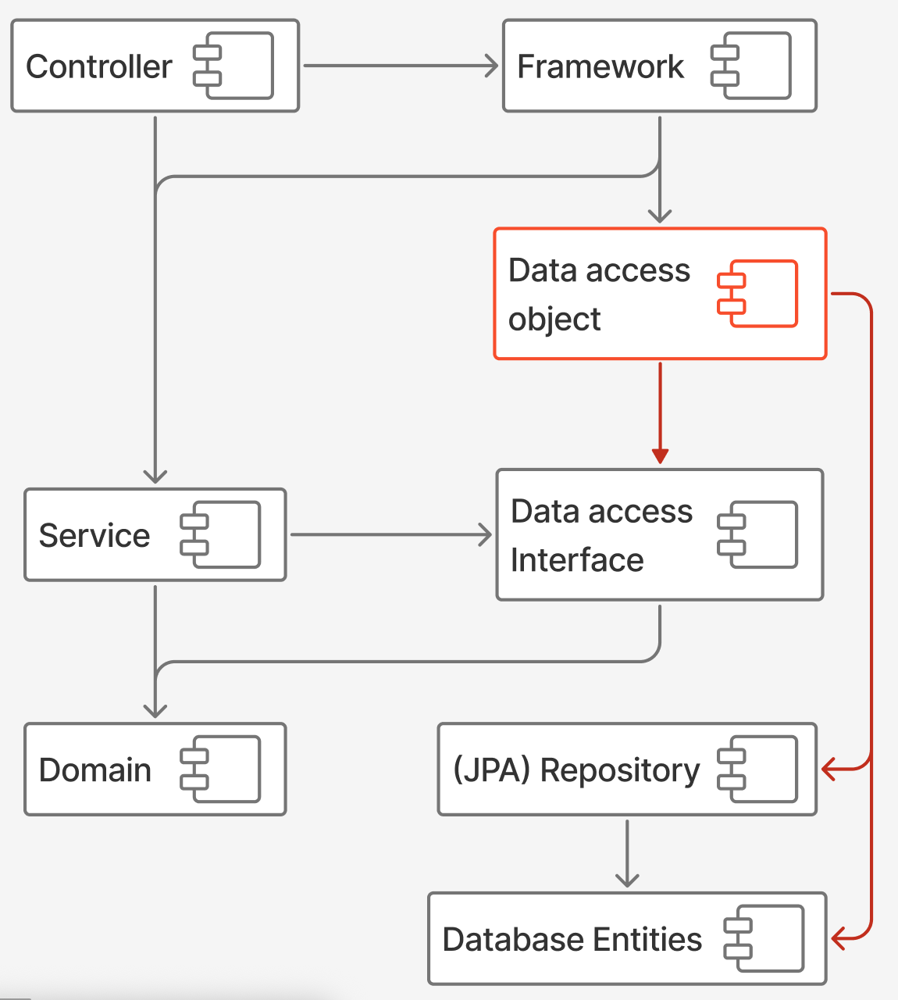
</div>

---

<div class="stretch" style="display: flex; justify-content: center; align-items: center; width: 100%">
<div style="flex-grow: 2">

```java
package com.example.config;

// imports 

@Configuration
public class Config {
  @Bean
  public SomeService someService(SomeRepository repo) {
    return new SomeService(repo);
  }
    
  @Bean
  public SomeRepository someRepository(
      SomeJpaRepository repo) {
    return new SomeRepositoryJpaDao(repo);
  }
}
```

</div>
    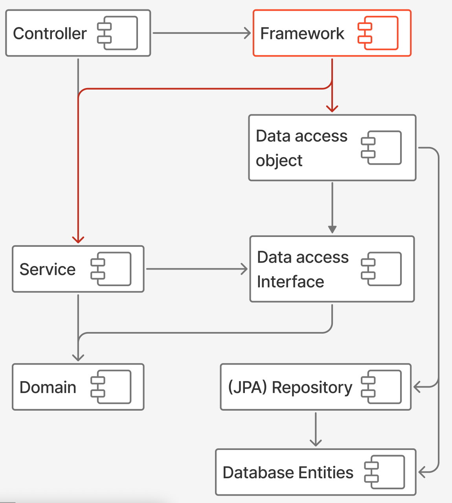
</div>

---

# Conclusion

<!-- .slide: class="fragmented-lists" -->
* Frameworks are great, but don't let them dictate your architecture
* Keep your core domain and logic independent
* Use the Dependency Inversion Principle to separate concerns

---

## CHILIT @ J-Spring 2025

### Spice, waffles, fun and games!


